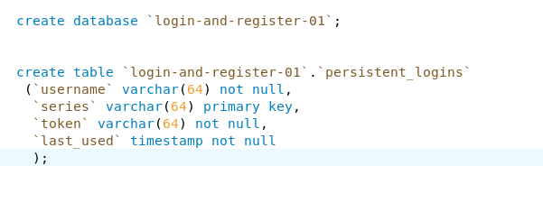
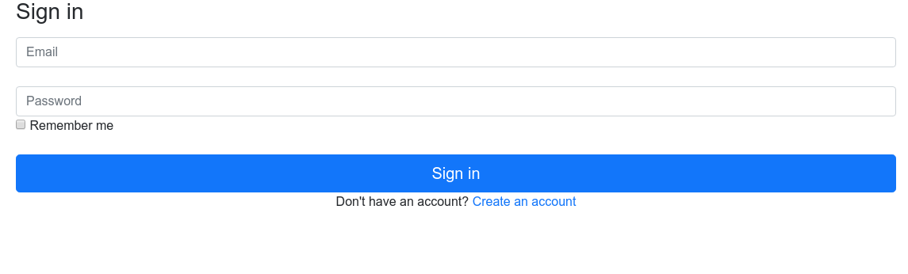
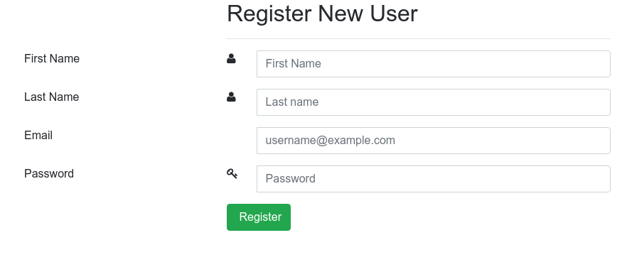

# Spring-Boot Login and Registration using spring security 
Spring Boot Login and Registration using  spring Security.

# First create Database `login-and-register-01`
             then
             create `persistent_logins` table manually
             according to the given image
             

 now your project is setup 🙂🙂🙂🙂
 
 # See the ScreenShot below 
 
 # Login Page
 

# Registration Page

# Welcome Page

